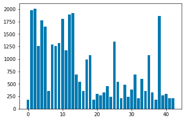
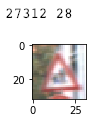
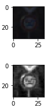
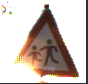
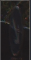
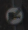
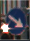
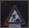
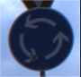

# **Traffic Sign Recognition**

## Writeup

### You can use this file as a template for your writeup if you want to submit it as a markdown file, but feel free to use some other method and submit a pdf if you prefer.

---

**Build a Traffic Sign Recognition Project**

The goals / steps of this project are the following:
* Load the data set (see below for links to the project data set)
* Explore, summarize and visualize the data set
* Design, train and test a model architecture
* Use the model to make predictions on new images
* Analyze the softmax probabilities of the new images
* Summarize the results with a written report

[//]: # (Image References)

[image1]: ./examples/visualization.jpg "Visualization"
[image2]: ./examples/grayscale.jpg "Grayscaling"
[image3]: ./examples/random_noise.jpg "Random Noise"
[image4]: ./examples/placeholder.png "Traffic Sign 1"
[image5]: ./examples/placeholder.png "Traffic Sign 2"
[image6]: ./examples/placeholder.png "Traffic Sign 3"
[image7]: ./examples/placeholder.png "Traffic Sign 4"
[image8]: ./examples/placeholder.png "Traffic Sign 5"

## Rubric Points
### Here I will consider the [rubric points](https://review.udacity.com/#!/rubrics/481/view) individually and describe how I addressed each point in my implementation.  

---
### Writeup / README

#### 1. Provide a Writeup / README that includes all the rubric points and how you addressed each one. You can submit your writeup as markdown or pdf. You can use this template as a guide for writing the report. The submission includes the project code.

You're reading it! and here is a link to my [project code](https://github.com/udacity/CarND-Traffic-Sign-Classifier-Project/blob/master/Traffic_Sign_Classifier.ipynb)

### Data Set Summary & Exploration

#### 1. Provide a basic summary of the data set. In the code, the analysis should be done using python, numpy and/or pandas methods rather than hardcoding results manually.

I used the pandas library to calculate summary statistics of the traffic
signs data set:

* The size of training set is 34799
* The size of the validation set is 4410
* The size of test set is 12630
* The shape of a traffic sign image is (32,32)
* The number of unique classes/labels in the data set is 43

#### 2. An exploratory visualization of the dataset.

Here is an exploratory visualization of the data set. It is a bar chart showing how the distribution of different traffic signs in the training set.

Here is a sample sign.

### Design and Test a Model Architecture

#### 1. Preprocessing
Without preprocessing, a lot of images are either too dark or too bright. The goal of preprocessing is to make most images look better.

First try, I am using the (pixel-128)/128 formula to normalize the image. The result is about 0.892. There is no significant improvement. because it does not really address the problem of too dark or too bright image

To get better, I noticed that some of the image are very dark (for example,
Training set image 33333 is very dark.). This leads me to the first optimization -- normalize brightness by using grayscale and normalizing it using the following formula
`channel = (channel - channel_min)/(channel_max - channel_min)`

With RGB-> Gray and normalize the grayscale. I got about 0.92-0.93 accuracy.

I also tried converting RGB to HLS and construct image with only normalized L channel. Because this is essentially the same idea of normalizing the grayscale image. With the same parameters, I got about the same validation accuracy as the grayscale normalizing. Therefore, I choose to use the grayscale normalization.

I have addressed the dark image problem with normalization. The next thing is to tune the architecture to make it more accurate.

#### 2. Final model architecture

My final model consisted of the following layers:

| Layer         		|     Description	        					|
|:---------------------:|:---------------------------------------------:|
| Input         		| 32x32x3 RGB image   							|
| Convolution 3x3     	| 1x1 stride, valid padding, outputs 30x30x24 	|
| RELU					|												|
| Max pooling	      	| 2x2 stride,  outputs 15x15x30 				|
| Convolution 3x3	    | 1x1 stride, valid padding, outputs 13x13x80       									|
| Max pooling	      	| 2x2 stride,  outputs 6x6x80				|
| Flatten		|       output 2880  									|
| Fully connected		|    output 600     									|
| Fully connected		|    output 200     									|
| Fully connected		|    output n_classes     									|

#### 3. Describe how you trained your model. The discussion can include the type of optimizer, the batch size, number of epochs and any hyperparameters such as learning rate.
To train the model, I use the LeNet model from previous exercise.
I started with epoches = 10. This does not usually get to good enough accuracy so I think it is too small. Then I increase epoches to 20. The result improved. So I tried epoches = 30. The result does not improved after 20 so I choose epoches = 20.

I started with learning rate = 0.001. Then I tried 0.0005. The result does not improve with 0.0005. Then I tried 0.002, which does not change the result much. So I stick with rate = 0.001

I started with batch size =128. Then I tried batch size = 64. The result becomes unstable. Then I tried batch size = 256. Result is similar to batch size = 128
Finally, I ended up with batch size = 128

I tried the GradientDescentOptimizer, the result is a much slower improvement between epoches and required far more epoches to converge. For example, 20 epoches only reaches about 0.69 accuracy. And 40 epoches reaches about 0.79 accuracy. Therefore, AdamOptimizer is a far better optimizer.

The validation result is about 0.9 with these hyper-parameters

#### 4. Approach of finding the best solution
My final model results were:
* validation set accuracy of 0.961
* test set accuracy of 0.95

My first architecture is the standard LeNet architecture. It is a good starting point because it was publicly proven to be working by Yann Lecun. The validation accuracy is about **0.92**.

Looking at the default setting, I noticed that the LeNet architecture has a 84 neuron to 10 classes mapping in the last stage. The traffic sign has 43 classes. Therefore, it seems to me that the number of neuron is not enough to reliably predict the outcome of 43 classes. So I believe the model is **underfitting**. Given the  my first guess is to multiply the depth and the neurons by roughly 4. Depth of first convolution layer is 24, depth of second convolution layer is 64, first fully connected layer is 700, second fully connected layer is 300. The result is **0.955 validation accuracy.**

I observed that the input image is 32x32, which is a small image. Maybe the 5x5 filter is too big for it. So I try to reduce it to 3x3. The result is extra improvement on the accuracy. The validation accuracy is **0.963**.

Originally, I was satisfied with this result. So I ran the test. The test set accuracy is 0.942, which is smaller than 0.963. It is an indication of overfitting.
Given this information, I tried to reduce overfitting by pruning some of the neuron and depth of the convolution layer. I first reduct second convolution layer depth to 48, first fully connected layer to 500, second fully connected layer to 200. The result is a much worse validation accuracy at about 0.93 and test accuracy 0.92.

Looks like reducing the convolution layer depth and neuron does not work. I tried to increase them instead. Depth of first convolution layer is 30, depth of second convolution layer is 80, first fully connected layer is 600, second fully connected layer is 200. The **validation accuracy is 0.961 and the test accuracy is 0.95**. This means I am hitting the right direction by making the convolution layer deeper but fully connected layer smaller.  

My focus is keeping validation accuracy while trying to increase test accuracy. This means I still need to reduce overfitting. I added a dropout between the first fully connected layer and the second fully connected layer. At first, I use 0.5 as the keep probability. The result is validation accuracy =0.96 and test accuracy =0.942. It is worse on both of the accuracy. Then I tried keep probability = 0.7, the accuracy is similar. Finally, I tried keep probability = 0.2. Accuracy is even worse. This is a signal that the dropout is not a good choice for the architecture.

### Test a Model on New Images

#### 1. Test images
Here are seven German traffic signs that I found on the web:

The first image might be difficult to classify because the bright spot cuts off part of the sign.

#### 2. Model prediction overview

Here are the results of the prediction:

| Image			        |     Prediction	        					|
|:---------------------:|:---------------------------------------------:|
| Children crossing     		| Children crossing 					 				|
| Keep left		| Keep left    							|
| Keep right				| Keep right											|
| End of no passing by vehicles over 3.5 metric tons     		| End of no passing by vehicles over 3.5 metric tons sign   									|
| Keep right		| Keep right   							|
| Road work   			| Road work										|
| Roundabout mandatory			| Roundabout mandatory     							|

The model was able to correctly guess all traffic signs.

I noticed there are randomness on the trained model between runs. At one previous runs, with all the hyperparameters the same, the prediction of "Children crossing" was "Bumpy Road".

#### 3. Model predictions details

The code for making predictions on my final model is located in the "Analyze Performance"" cell of the Ipython notebook.

For the first image, the model is relatively sure that this is a Children crossing sign (probability of 0.67), and the image does contain a Children crossing sign. The top five soft max probabilities were

| Probability         	|     Prediction	        					|
|:---------------------:|:---------------------------------------------:|
| .67         			| Children crossing  									|
| .30     				| Beware of ice/snow										|
| .03					| Bicycles crossing										|
| .02	      			| Bumpy Road					 				|
| .005				    | Road narrows on the right    							|

For the second image, the model is very sure that this is a Keep left sign (probability of 0.99998), and the image does contain a Keep left sign. The rest of the probabilities are close to 0 so I skip the full list.

For the third image, the model is very sure that this is a Keep right sign (probability of 0.9996), and the image does contain a Keep right sign. The rest of the probabilities are close to 0 so I skip the full list.

For the fourth image, the model is very sure that this is a "End of no passing by vehicles over 3.5 metric tons" sign (probability of 1), and the image does contain a "End of no passing by vehicles over 3.5 metric tons sign. The rest of the probabilities are close to 0 so I skip the full list.

For the fifth image, the model is very sure that this is a Keep right sign (probability of 1), and the image does contain a Keep right sign. The rest of the probabilities are close to 0 so I skip the full list.

For the sixth image, the model is very sure that this is a Road work sign (probability of 1), and the image does contain a Road work  sign. The rest of the probabilities are close to 0 so I skip the full list.

For the seventh image, the model is very sure that this is a Roundabout mandatory sign (probability of 1), and the image does contain a Roundabout mandatory  sign. The rest of the probabilities are close to 0 so I skip the full list.

### (Optional) Visualizing the Neural Network (See Step 4 of the Ipython notebook for more details)
#### 1. Discuss the visual output of your trained network's feature maps. What characteristics did the neural network use to make classifications?
